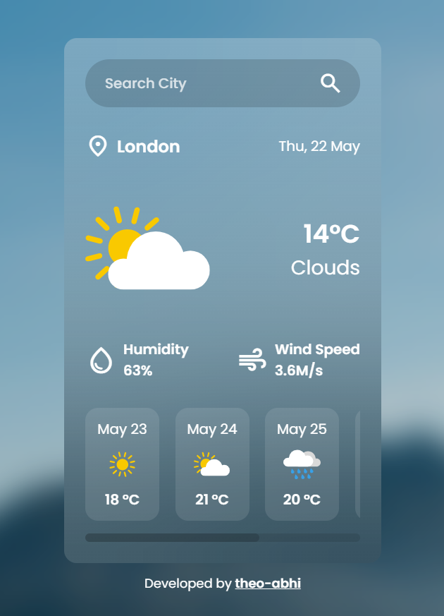

# Weather-API-Application-HTML-CSS-JS

A dynamic and responsive weather application built with **HTML**, **CSS**, and **JavaScript**, using a live **Weather API** to display current conditions and a 5-day forecast for any city worldwide.

## 🌤️ Features

- **Live Weather Data:** Shows current temperature, weather condition, humidity, wind speed, and more.
- **5-Day Forecast:** Includes a detailed 5-day weather outlook for each searched city.
- **City-Based Search:** Users can search for any city globally.
- **Responsive Design:** Fully responsive and mobile-friendly layout.
- **API Integration:** Utilizes a weather API (e.g., OpenWeatherMap) to fetch real-time data.
- **Error Handling:** Displays informative messages for invalid input, network issues, or missing data.

## 🖼️ Preview



## 🛠️ Tech Stack

- **HTML5** – Page structure
- **CSS3** – Styling and layout
- **JavaScript (ES6)** – Logic, API calls, and DOM manipulation
- **Weather API** – Provides live weather data and forecasts

## 📁 Project Structure

Weather-API-Application-HTML-CSS-JS/
├── index.html
├── style.css
├── script.js
└── README.md

## 🔍 How It Works

1. User types a city name into the search bar.
2. The app makes a request to the Weather API.
3. The response includes current weather and a 5-day forecast.
4. The UI updates dynamically with all the weather details.
5. Any errors (e.g., city not found) are caught and displayed clearly.

## 📦 Getting Started

1. Clone the repository:

```bash
git clone https://github.com/your-username/Weather-API-Application-HTML-CSS-JS.git
```

2. Open index.html in your browser.

3. (Optional) If your API key is required:

4. Open script.js

5. Replace the placeholder with your actual API key:

   const apiKey = "YOUR_API_KEY_HERE";

🔐 API Key Note

Ensure your API key is not exposed in public repositories. Use restricted or free-tier keys for demos. You can also use a .env setup for local development security.

✨ Future Improvements

1. Add geolocation support to auto-detect user location

2. Toggle temperature units (Celsius ↔ Fahrenheit)

3. Add weather icons and animations

4. Implement dark/light theme toggle

5. Deploy via GitHub Pages
